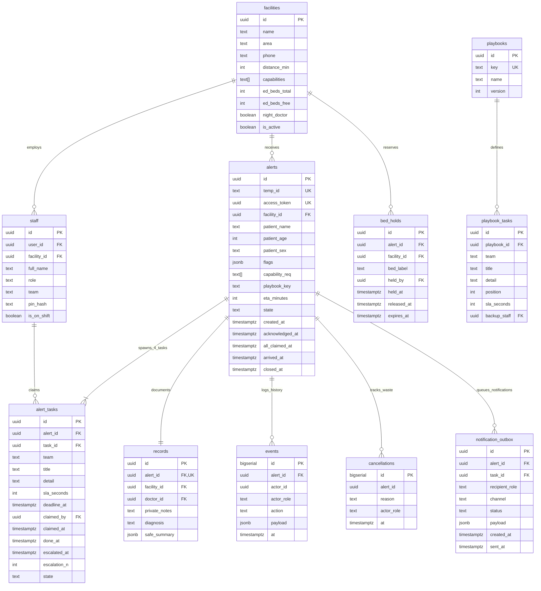

# GoldenHour Data Model & Relationships
**Blueprint v1.2 §7.3 & §8 / NIRMAN 2026**

```mermaid
erDiagram
    facilities ||--o{ staff : employs
    facilities ||--o{ alerts : receives
    facilities ||--o{ bed_holds : reserves
    playbooks ||--o{ playbook_tasks : defines
    alerts ||--|{ alert_tasks : spawns_4_tasks
    alerts ||--|| records : documents
    alerts ||--o{ events : logs_history
    alerts ||--o{ cancellations : tracks_waste
    alerts ||--o{ notification_outbox : queues_notifications
    staff ||--o{ alert_tasks : claims

    facilities {
        uuid id PK
        text name
        text area
        text phone
        int distance_min
        text[] capabilities
        int ed_beds_total
        int ed_beds_free
        boolean night_doctor
        boolean is_active
    }

    staff {
        uuid id PK
        uuid user_id FK
        uuid facility_id FK
        text full_name
        text role
        text team
        text pin_hash
        boolean is_on_shift
    }

    playbooks {
        uuid id PK
        text key UK
        text name
        int version
    }

    playbook_tasks {
        uuid id PK
        uuid playbook_id FK
        text team
        text title
        text detail
        int position
        int sla_seconds
        uuid backup_staff FK
    }

    alerts {
        uuid id PK
        text temp_id UK
        uuid access_token UK
        uuid facility_id FK
        text patient_name
        int patient_age
        text patient_sex
        jsonb flags
        text[] capability_req
        text playbook_key
        int eta_minutes
        text state
        timestamptz created_at
        timestamptz acknowledged_at
        timestamptz all_claimed_at
        timestamptz arrived_at
        timestamptz closed_at
    }

    alert_tasks {
        uuid id PK
        uuid alert_id FK
        uuid task_id FK
        text team
        text title
        text detail
        int sla_seconds
        timestamptz deadline_at
        uuid claimed_by FK
        timestamptz claimed_at
        timestamptz done_at
        timestamptz escalated_at
        int escalation_n
        text state
    }

    bed_holds {
        uuid id PK
        uuid alert_id FK
        uuid facility_id FK
        text bed_label
        uuid held_by FK
        timestamptz held_at
        timestamptz released_at
        timestamptz expires_at
    }

    records {
        uuid id PK
        uuid alert_id FK,UK
        uuid facility_id FK
        uuid doctor_id FK
        text private_notes
        text diagnosis
        jsonb safe_summary
    }

    events {
        bigserial id PK
        uuid alert_id FK
        uuid actor_id
        text actor_role
        text action
        jsonb payload
        timestamptz at
    }

    cancellations {
        bigserial id PK
        uuid alert_id
        text reason
        text actor_role
        timestamptz at
    }

    notification_outbox {
        uuid id PK
        uuid alert_id FK
        uuid task_id FK
        text recipient_role
        text channel
        text status
        jsonb payload
        timestamptz created_at
        timestamptz sent_at
    }
```
